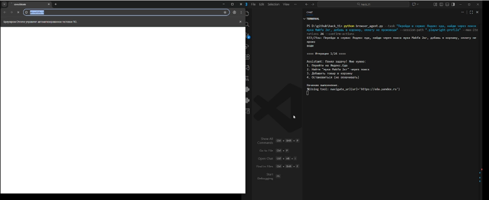

AI Browser Agent (Anthropic + Playwright)
=========================================

Небольшой агент, который с помощью API Anthropic (Claude) и Playwright управляет реальным браузером:
открывает сайты, кликает по элементам, заполняет формы, скроллит страницу и т.п., исходя из задачи,
заданной на естественном языке.



Структура проекта
-----------------

- `main.py` — CLI-входная точка, парсит аргументы и запускает агента.
- `browser_agent.py` — тонкая обёртка, чтобы можно было вызывать `python browser_agent.py`, но логика та же, что в `main.py`.
- `agent/` — логика самого браузерного агента и подагента по DOM:
  - `agent/browser_agent.py` — класс `BrowserAgent`, который общается с Claude и вызывает инструменты.
  - `agent/dom_sub_agent.py` — подагент для детального анализа DOM (структуры страницы).
- `core/` — общие сущности:
  - `core/config.py` — базовая конфигурация, модель по умолчанию, настройка логирования в `log.txt`.
  - `core/models.py` — дата-классы для конфигурации агента и структур DOM.
  - `core/prompts.py` — системный промпт и описание инструментов для Claude.
- `infrastructure/` — обёртки над Playwright и инструментами:
  - `infrastructure/browser_session.py` — запуск и закрытие браузера (Chromium, persistent-профиль).
  - `infrastructure/tools.py` — реализация инструментов (`analyze_page`, `click_element`, `type_text`, `navigate_url`, `extract_text`, и т.д.).
- `requirements.txt` — зависимости Python.
- `log.txt` — лог работы агента (создаётся и дописывается автоматически).
- `.playwright-profile/` — persistent-профиль браузера (куки/сессии).
- `.shots/` — по желанию, каталог для скриншотов.

Стек и версии
-------------

Минимальный стек для запуска:

- Python **3.10+** (рекомендуется 3.10 или 3.11).
- Библиотеки Python (см. `requirements.txt`):
  - `anthropic>=0.34.0`
  - `playwright>=1.47.2`
- Установленный браузер Chromium для Playwright.
- Учётка и API‑ключ Anthropic (Claude), переменная окружения `ANTHROPIC_API_KEY`.

Быстрая установка
-----------------

1. Клонировать/скачать репозиторий и перейти в папку проекта:

   ```bash
   cd ai_agent
   ```

2. (Опционально, но желательно) создать виртуальное окружение:

   **Windows (PowerShell):**
   ```powershell
   python -m venv .venv
   .\.venv\Scripts\Activate.ps1
   ```

   **Linux/macOS (bash/zsh):**
   ```bash
   python -m venv .venv
   source .venv/bin/activate
   ```

3. Установить зависимости Python:

   ```bash
   pip install -r requirements.txt
   ```

4. Установить браузер для Playwright (используется Chromium с persistent-профилем):

   ```bash
   python -m playwright install chromium
   ```

Настройка `ANTHROPIC_API_KEY`
-----------------------------

Агент напрямую использует SDK Anthropic (`anthropic.Anthropic()`), поэтому требуется API‑ключ.
Его необходимо положить в переменную окружения `ANTHROPIC_API_KEY`.

- **Windows (PowerShell):**

  ```powershell
  $env:ANTHROPIC_API_KEY="sk-ant-..."   # ваш ключ
  ```

- **cmd.exe:**

  ```cmd
  set ANTHROPIC_API_KEY=sk-ant-...
  ```

- **Linux/macOS:**

  ```bash
  export ANTHROPIC_API_KEY="sk-ant-..."
  ```

После этого можно запускать `python main.py ...` в той же сессии терминала.

Быстрый старт (CLI)
-------------------

Простейший запуск (без headless, чтобы видеть браузер):

```bash
python main.py --task "Открой google.com, найди 'погода Москва' и открой первый результат"
```

Headless‑режим (браузер без окна, полезно для серверов/CI):

```bash
python main.py --task "Проверь курс EUR/RUB на любом популярном сайте" --headless
```

Пример с авторизацией (сначала войти руками, потом дать агенту работать):

```bash
python main.py ^
  --task "Зайди в Gmail, найди последнее непрочитанное письмо и прочитай тему" ^
  --manual-login ^
  --confirm-actions
```

> На Linux/macOS вместо `^` используйте `\` для переноса строк, либо напишите всё в одну строку.

Основные аргументы CLI
----------------------

Аргументы объявлены в `parse_args()` в `main.py`:

- `--task` (обязательно)  
  Текст задачи на естественном языке (русский/английский и т.п.).

- `--session-path` (по умолчанию: `.playwright-profile`)  
  Папка для persistent‑профиля Chromium. Позволяет сохранять куки и авторизацию между запусками.

- `--model` (по умолчанию: значение `core.config.DEFAULT_MODEL`)  
  Имя модели Anthropic. В `core/config.py` по умолчанию:
  ```python
  DEFAULT_MODEL = "claude-sonnet-4-5-20250929"
  ```
  Можно передать любое другое совместимое имя модели, например:
  ```bash
  python main.py --task "..." --model "claude-3-5-sonnet-20241022"
  ```

- `--max-iterations` (по умолчанию: `12`)  
  Максимальное число итераций цикла агента (шаг: думать → вызвать инструменты → обновить план).

- `--headless` (флаг)  
  Если указан — Playwright запускается в headless‑режиме.

- `--screenshot-dir` (по умолчанию: `.shots`)  
  Каталог для скриншотов. Если передать пустую строку, скриншоты отключатся.

- `--manual-login` (флаг)  
  Сначала открывает браузер для ручного логина, затем ждёт нажатия Enter в терминале и только после этого
  запускает агента. Удобно для задач, требующих авторизованных действий.

- `--confirm-actions` (флаг)  
  Перед потенциально разрушительными действиями (например, удаление/отправка/публикация) агент запросит
  подтверждение в терминале.

- `--history-window` (по умолчанию: `7`)  
  Сколько последних диалоговых шагов держать полностью; более старые сообщения агент автоматически
  резюмирует, чтобы не раздувать контекст.

- `--max-stuck-steps` (по умолчанию: `0`)  
  Deprecated; логика «застревания» сейчас не используется.

Логи и артефакты
----------------

- `log.txt` — текстовый лог работы, настраивается в `core/config.py`:

  ```python
  logging.basicConfig(
      filename="log.txt",
      filemode="a",
      level=logging.INFO,
      format="%(asctime)s %(message)s",
      encoding="utf-8",
  )
  ```

  Файл дописывается при каждом запуске (режим `append`).

- `.playwright-profile/` — persistent‑профиль Chromium (куки, локальное хранилище, сессии).
- `.shots/` — папка для скриншотов (если задана через `--screenshot-dir`).

Пример использования как библиотеки
-----------------------------------

Если нужно запустить агента из собственного Python‑кода, можно повторить логику `main.py`:

```python
from pathlib import Path

from agent.browser_agent import BrowserAgent
from core.config import AgentConfig, DEFAULT_MODEL
from infrastructure.browser_session import BrowserSession
from infrastructure.tools import ToolExecutor

config = AgentConfig(
    model=DEFAULT_MODEL,
    task="Открой example.com и прочитай заголовок главной страницы",
    session_path=Path(".playwright-profile"),
    headless=False,
    max_iterations=8,
    screenshot_dir=Path(".shots"),
    manual_login=False,
    confirm_actions=False,
    history_window=7,
    temperature=0.0,
)

with BrowserSession(config.session_path, config.headless) as session:
    executor = ToolExecutor(session, config.screenshot_dir)
    agent = BrowserAgent(config, executor)
    agent.run()
```

Перед запуском убедитесь, что:

- установлены зависимости из `requirements.txt`;
- выполнена команда `python -m playwright install chromium`;
- в окружении есть `ANTHROPIC_API_KEY`.

Рекомендации по безопасности
----------------------------

- Агент может выполнять действия от вашего имени в браузере (отправка форм, клики по кнопкам удаления,
  размещение постов и т.д.). Используйте `--confirm-actions` для важных аккаунтов.
- Соблюдайте правила и условия использования сайтов, на которых запускаете агента.
- Не запускайте опасные задачи на боевых аккаунтах, пока не протестируете поведение на тестовых.
